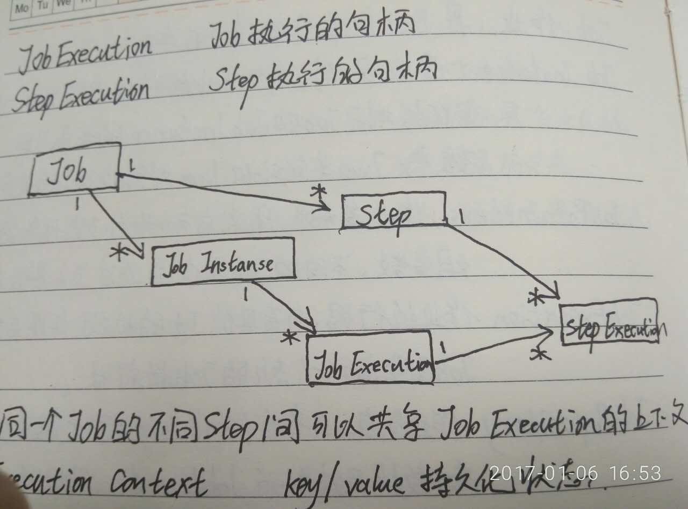

#Spring Batch 批处理框架
###重要的知识点：
1. Job:作业，是Batch操作的基础单元。
2. JobInstance:作业实例，每个作业执行时，都会生成一个实例，对于Job和JobInstance的关系可以想象Java类定义和Java对象实例的关系。
3. JobParameters:作业参数，用来启动批处理任务的一组参数，不同的Job实例是通过Job参数来区分。
4. JobExecution:作业执行器，负责具体Job的执行，每次运行Job都会启动一个新的JobExecution。
5. JobLauncher:作业调度器，根据给定的JobParameters启动作业。
6. JobRespository:作业仓库，负责存储作业执行过过程中的状态，数据结果。为JobLauncher、Job、Step提供标准的CRUD实现。

###上下文关系

  

