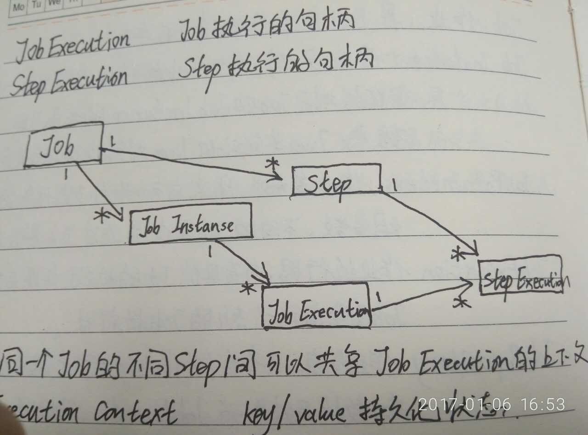
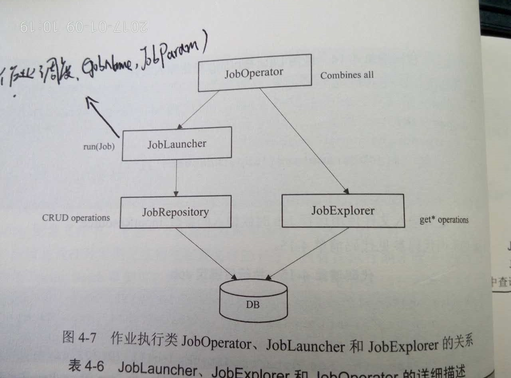

#Spring Batch 批处理框架
###重要的知识点：
1. Job:作业，是Batch操作的基础单元。
2. JobInstance:作业实例，每个作业执行时，都会生成一个实例，对于Job和JobInstance的关系可以想象Java类定义和Java对象实例的关系。
3. JobParameters:作业参数，用来启动批处理任务的一组参数，不同的Job实例是通过Job参数来区分。
4. JobExecution:作业执行器，负责具体Job的执行，每次运行Job都会启动一个新的JobExecution。
5. JobRespository:作业仓库，负责存储作业执行过过程中的状态，数据结果。为JobLauncher、Job、Step提供标准的CRUD实现。
6. JobLauncher:作业调度器，根据给定的JobParameters启动作业。
7. JobExplorer:主要负责从JobRespository中获取执行的信息，包括获取作业实例、作业执行器、作业步执行器、正在运行的作业执行器、作业列表等操作。
8. JobOperator:包含了JobLauncher、JobExplorer中的大部分操作。
###上下文关系

  


###高级特性
1. Scope：secpe用来声明IOC容器中对象的存活空间，即在IOC容器在对象进入相应的Scope之前，生成并装配这些对象，在该对象不再处于这些Scope的限定范围之后，容器通常会销毁这些对象。
2. Step Scope：是Spring Batch框架提供了自定义的Scope,将Spring Bean定义为Step Scope,支持Spring Bean在Step开始的时候初始化，在Step结束的时候销毁Spring Bean,将Spring Bean的生命周期与Step绑定。
3. Late Bingding：后绑定技术，Spring Batch框架提供特定的表达式支持为Job或者Step关联的实体使用后绑定技术。在Step Scope中Spring Batch框架提供的可以使用的实体包括jobParameters、jobExecutionContext、stepExecutionContext。eg:<br>
```
	#{jobParameters['inputResource']}。
```
4. taskExecutor：默认情况下，JobLauncher的run操作通过同步方式调用Job,任何调用Job的客户端需要等待Job的执行结果返回才能结束。配置异步调用的JobLauncher只需要增加属性taskExecutor，该属性表示当前执行的线程池。
eg:<br>

			<task:executor id="executor" pool-size="5">
			<bean:bean id = "jobLlauncherAsyn" class="org.springframework.batch.core.launch.support.SimpleJobLauncher">
				<bean:property name="jobRepository" ref="jobRespository"/>
				<bean:property name="taskExecutor" ref="executor"/>
			</bean:bean>


