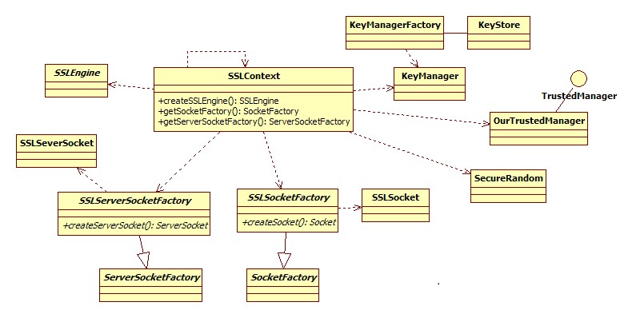
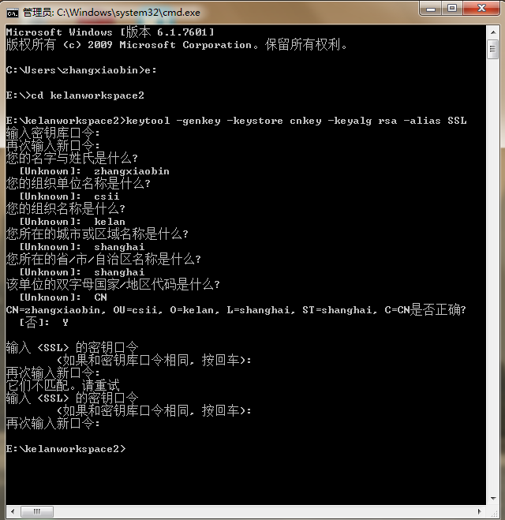

#SSLContext
SSLSocket扩展Socket并提供使用SSL或TLS协议的安全套接字。

---

##类图

>KeyStore: 表示密钥和证书的存储设施

>KeyManager: 接口，JSSE密钥管理器

>TrustManager: 接口，信任管理器(?翻译得很拗口) 

>X590TrustedManager: TrustManager的子接口，管理X509证书，验证远程安全套接字

##SSLServerSocket

- 使用keytool工具生成一个证书。

>